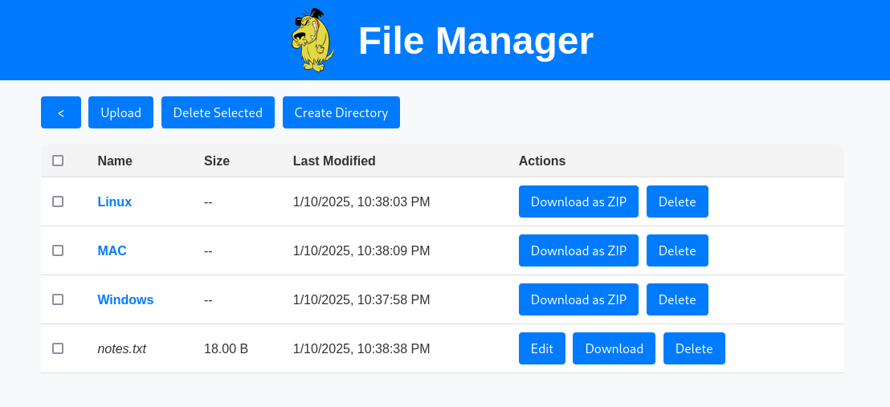

# Muttley - File Manager
Muttley is a sleek and user-friendly file manager designed for local and server-side file management.
Built with Node.js on the backend and an intuitive HTML, CSS, and JavaScript frontend,
Muttley provides a robust solution for navigating, uploading, downloading, and managing files seamlessly.



## 🔔 Features
- **Dynamic File Navigation**: Effortlessly navigate through directories with a clean and responsive UI.
- **Upload and Download**: Drag-and-drop file uploads with progress feedback and easy file downloads, including support for downloading directories as ZIP archives.
- **Edit On-the-Fly**: Edit text files directly within the app using the built-in editor.
- **PDF Preview**: Preview PDF files directly in an overlay popup without leaving the interface, using a built-in viewer with iframe rendering.
- **Batch Operations**: Delete multiple files and folders simultaneously, with confirmation prompts for non-empty directories.
- **Streamlined Design**: A visually appealing layout with an integrated header featuring a clickable logo and title for easy navigation back to the root directory.
- **Basic Authentication support**: Optional Basic Authentication ensures secure access by requiring a username and password. Easily configurable in the backend, it protects against unauthorized usage while maintaining flexibility for deployments without mandatory login.

## 📦 Technologies Used
- **Easy deployment**: Docker and docker-compose.yml
- **Backend**: Node.js for managing file operations and routing.
- **Frontend**: HTML, CSS, and JavaScript for a responsive and interactive user experience.
- **File Management Features**: Robust handling of file sizes, folder structures, and metadata.

## 🔎 Usage
### Automated deployment using certbot SSL certificates and nginx reverse proxy (Recommended for public network production environment)
```bash
wget -c https://raw.githubusercontent.com/mtimani/Muttley/refs/heads/main/ssl-automated-deployment/ssl-automated-deployment.sh
chmod +x ssl-automated-deployment.sh

# Install Muttley with Basic Auth
sudo ./ssl-automated-deployment.sh -d $DOMAIN_NAME -e $CERTBOT_EMAIL -b $BASIC_AUTH_USERNAME:$BASIC_AUTH_PASSWORD

# Install Muttley without Basic Auth
sudo ./ssl-automated-deployment.sh -d $DOMAIN_NAME -e $CERTBOT_EMAIL
```

`ssl-automated-deployment.sh` help:
```bash
Usage: ./ssl-automated-setup.sh -d <domain_name> -e <certbot_email> [-b <auth_username:auth_password>]

  -d <domain_name>       The domain name for SSL setup.
  -e <certbot_email>     The email for Certbot registration.
  -b <username:password> Optional. Enables BasicAuth with specified username and password.
  -h                     Display this help message.
```

### Using Docker (Recommended for local network production environment)
> :warning: **Please check the environment variables and the shared volume before launching the `docker compose up -d` command!** 
```bash
wget -c https://raw.githubusercontent.com/mtimani/Muttley/refs/heads/main/docker-compose.yml
docker compose up -d
```

### Standalone (Recommended for developpment and testing)
#### Installation
```bash
git clone https://github.com/mtimani/Muttley.git
```

#### Usage (without Basic Authentication)
```bash
cd /docker-build/Muttley-JS/backend
FILE_SERVER_ROOT="./data" npm start
```

#### Usage (with Basic Authentication)
```bash
cd /docker-build/Muttley-JS/backend
AUTH_USERNAME=admin AUTH_PASSWORD=supersecurepassword FILE_SERVER_ROOT="./data" npm start
```

## 📖 Why Muttley?
Whether you’re a developer managing server files or a user looking for a simple local file explorer, Muttley is designed to make file management straightforward, efficient, and enjoyable.
